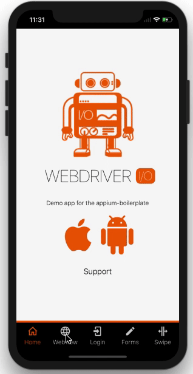

# WebdriverIO Demo App for iOS and Android

This app is build with React Native and will be used for test automation purposes for the [appium-boilerplate](https://github.com/webdriverio/appium-boilerplate).

> **NOTE **
> Make sure to use yarn instead of NPM. NPM gives a lot of problems currently with React Native[^1]. How to setup yarn can be found [here](https://yarnpkg.com/lang/en/docs/install/#mac-stable)

[^1] NPM gives a lot of problems currently with React Native, only from what I've seen with the migration.
     
     - React Natve 0.60.x now uses Pods for linking dependencies, from what I've seen with NPM is that is messes up this linking 9 out of 10 times
     - Installing other dependencies are mostly recommended to install with yarn (not only for React Native but also with ReactJS)
     - It costed me around a day to get everything working with NPM, but with yarn I didn't had any problems migrating to RN 0.60
     - yarn is faster
     - and I can go on
     
     This is also the reason that the `package-lock.json` has been removed.
     

## Downloads
Different releases of the iOS and Android app can be downloaded [here](https://github.com/webdriverio/native-demo-app/releases)

> **NOTE:**
> The Android app can be installed on Android emulators and physical devices.
> The iOS app can also be installed iOS simulators (take the `\*.app.zip` file) or on physical iOS devices (take the `\*.ipa.zip` file)

## About
As mentioned this app will be used for the [appium-boilerplate](https://github.com/webdriverio/appium-boilerplate) so (new) users of WebdriverIO and Appium can play around.
How WebdriverIO and Appium can be used together can be found there, here you will only find the project to build the app.

The app holds the following screens:
- **Home:** The intro of the app
- **PictureView:** Clicking on the PictureView tab will open the WebdriverIO website (**only once**). It is created to test for example switching context and interacting with the PictureView
- **Login:** This screen contains a simple Login / Sign Up screen with validations and alerts
- **Forms:** This screen holds some basic form elements to interact with like:
  - **Input**
  - **CheckBox**
  - **DropDown**
  - **Button**
- **Swipe:** This screen will hold a carousel so swiping can be tested

## Contributing
If you'd like to contribute feel free to create a PR, please also look at the [building](./docs/BUILDING.md) and [versioning](./docs/VERSIONING.md)-docs.

## Credits
- [Lucas Bento](https://github.com/lucasbento) for helping me out with some React Native questions
- [React Native Elements](https://github.com/react-native-training/react-native-elements-app) for the example Login / Sign Up form
- [react-native-snap-carousel](https://github.com/archriss/react-native-snap-carousel) for the demo of the carousel
- [Tele2 SelectInput](https://github.com/Tele2-NL/react-native-select-input) for the select input component
